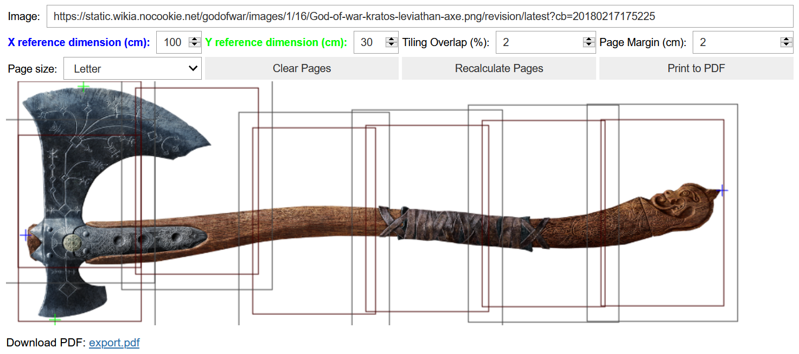

# PrintTile
Tile pages onto an image so it can be printed at scale

### Goal
Watched https://youtu.be/apeZO6C0ZeA, where Adam Savage prints out pieces of an image as a scale template for a project. Wanted to put together my own script to do the same job! If you found this project but it doesn't meet your needs, https://woodgears.ca/bigprint/ is worth a look.

### Key Capabilities
  * X and Y reference dimensions
  * support for different paper sizes, margins, and % page overlap
  * automatic page tiling
  * manual adjustment of pages
      * click-drag-click
      * move with WASD
      * confirm with Enter
      * delete with Delete
  * download link in the UI, once the print is generated

